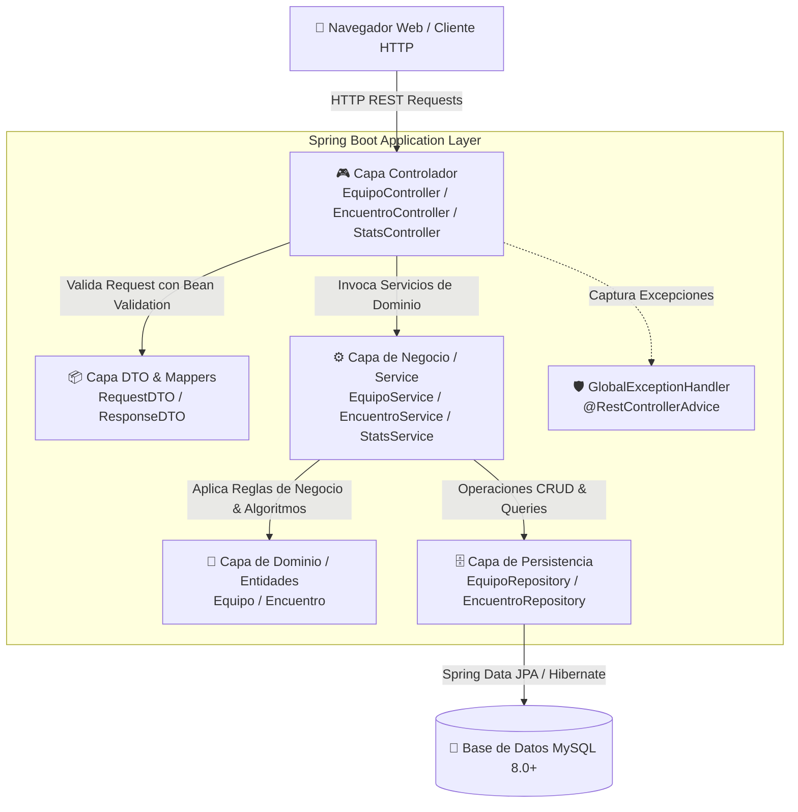
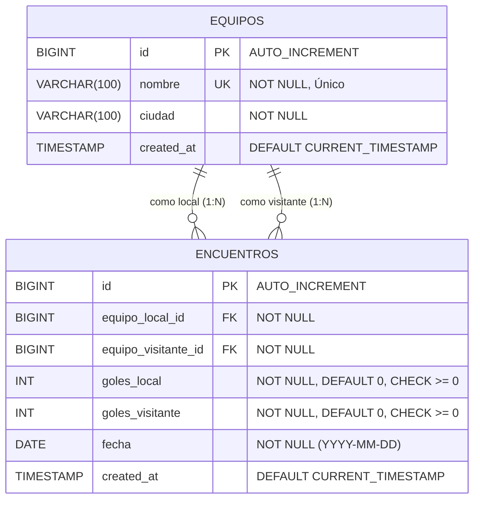

<div align="center">

# ⚽ Sistema de Gestión de Liga de Fútbol Pro

**Plataforma Integral de Administración de Torneos, Estadísticas en Tiempo Real y Tabla de Posiciones FIFA**

[](https://www.oracle.com/java/)
[](https://spring.io/projects/spring-boot)
[](https://spring.io/projects/spring-data-jpa)
[](https://www.mysql.com/)
[](https://getbootstrap.com/)
[](https://tailwindcss.com/)
[](#-arquitectura-del-sistema)
[](#-licencia)

<p align="center">
  <a href="#-demostración-rápida">Demostración Rápida</a> •
  <a href="#-características-principales">Características</a> •
  <a href="#-arquitectura-del-sistema">Arquitectura</a> •
  <a href="#-modelo-de-datos-der">Base de Datos</a> •
  <a href="#-catálogo-de-endpoints-api-rest">API REST</a> •
  <a href="#-instalación-y-despliegue">Instalación</a>
</p>

</div>

---

## 📖 Descripción General

El **Sistema de Gestión de Liga de Fútbol Pro** es una solución web empresarial desarrollada con **Spring Boot 3** y **MySQL** en el backend, acompañada de una Single-Page Application (SPA) responsiva en el frontend. Su propósito es centralizar la gestión de clubes, calendarización y registro de encuentros deportivos, cálculo automatizado de tablas de clasificación con criterios oficiales de desempate, generación de estadísticas analíticas y exportación de reportes en tiempo real.

Diseñado siguiendo las mejores prácticas de la industria: **arquitectura en capas desacopladas**, patrón **DTO**, manejo centralizado de excepciones con respuestas estructuradas, validaciones estrictas de reglas de negocio y cero dependencias pesadas de empaquetado Node.js en el frontend.

---

## ⚡ Demostración Rápida

Una vez iniciado el servidor, el sistema se sirve de forma unificada en:

```
http://localhost:8080/
```

- **Dashboard Principal:** Tablero de control con métricas en tiempo real (goles totales, promedio por fecha, líder de goleo y mejor defensa).
- **Tabla de Clasificación:** Podio interactivo con insignias en vivo (👑 Campeón, 🥈 Subcampeón, 🥉 Bronce) y cálculo automático de estadísticas.
- **Fixture & Partidos:** Listado de encuentros con filtros avanzados por equipo y rango de fechas.
- **Centro de Estadísticas:** Ficha técnica individual por club con visualización de la racha de los últimos 5 partidos (`V`, `E`, `D`).
- **Exportación:** Descarga instantánea de la tabla de posiciones en formato **CSV estándar UTF-8 con BOM**.

---

## ✨ Características Principales

### 🏟️ 1. Gestión de Clubes (Equipos)
- Alta, baja, edición y listado de instituciones deportivas.
- Validación de unicidad de nombre de equipo a nivel de dominio y base de datos.
- Búsqueda en tiempo real por coincidencia parcial de nombres.
- Ficha de rendimiento histórico con desglose de PJ, PG, PE, PP, GF, GC, DG y puntos acumulados.

### ⚽ 2. Gestión de Encuentros & Fixture
- Registro y actualización de marcadores y fechas de partidos.
- Filtros dinámicos por **equipo participante** y **rango de fechas** (`fechaInicio`, `fechaFin`).
- Acceso directo a los últimos encuentros disputados (`/api/encuentros/recientes`).
- Integridad referencial con eliminación en cascada controlada.

### 📊 3. Tabla de Posiciones Automatizada (Algoritmo Oficial)
Cálculo en memoria de alta eficiencia basado en el sistema de puntuación internacional:
- **Victoria:** 3 puntos
- **Empate:** 1 punto
- **Derrota:** 0 puntos

#### ⚖️ Criterio Oficial de Desempate (Multi-nivel):
1. **Mayor cantidad de Puntos (PTS)**
2. **Mejor Diferencia de Goles (DG = GF - GC)**
3. **Mayor cantidad de Goles a Favor (GF)**
4. **Orden alfabético ascendente** por nombre de club.

### 📈 4. Motor de Analytics & Reportes
- Resumen global del torneo: total de goles convertidos, promedio de anotación por juego, club más goleador y valla menos vencida.
- Indicador de forma deportiva (Racha de los últimos 5 partidos con badges semánticos: verde para victoria, amarillo para empate, rojo para derrota).
- Exportador nativo de tabla de posiciones a **CSV (RFC 4180)** con cabeceras `Content-Disposition` para descarga directa desde navegador o integración con Excel / BI.

### 🎨 5. Frontend SPA Moderno (2026 Ready)
- Estética premium con **Dark Mode inspirado en transmisiones deportivas de alta definición**.
- Construido con **Bootstrap 5.3 + Tailwind CSS CDN + Vanilla JavaScript ES6**.
- Sin necesidad de compilar paquetes de Node.js (`npm install` / `node_modules` innecesarios).
- Modales interactivos, notificaciones Toast no intrusivas y confirmaciones de seguridad para operaciones destructivas.

---

## 🏛️ Arquitectura del Sistema

El proyecto implementa una **Arquitectura en Capas (N-Tier Layered Architecture)** limpia y estrictamente desacoplada:



### Principios de Diseño Aplicados:
- **Single Responsibility (SRP):** Controladores delgados que delegan toda la lógica a la capa de servicio.
- **DTO Pattern:** Desacoplamiento total entre las entidades de base de datos JPA y las cargas útiles expuestas por la API, previniendo ataques de *Over-Posting*.
- **Manejo Centralizado de Excepciones:** `@RestControllerAdvice` captura errores de validación (`MethodArgumentNotValidException`), reglas de negocio (`ReglaDeNegocioException`), y recursos inexistentes (`ResourceNotFoundException`), devolviendo un formato JSON estándar y predecible.
- **Transaccionalidad Declarativa:** Uso de `@Transactional` para garantizar consistencia ACID y `@Transactional(readOnly = true)` para optimizar lecturas de base de datos.

---

## 🗄️ Modelo de Datos (DER)

El esquema relacional implementado en MySQL asegura integridad referencial y restricciones a nivel de motor:



### Restricciones de Dominio (Check Constraints):
- `chk_equipos_distintos`: `equipo_local_id <> equipo_visitante_id` (un club no puede jugar contra sí mismo).
- `chk_goles_local_positivos`: `goles_local >= 0`.
- `chk_goles_visitante_positivos`: `goles_visitante >= 0`.
- Claves foráneas con acción referencial `ON DELETE CASCADE`.

---

## 📡 Catálogo de Endpoints (API REST)

Base URL: `http://localhost:8080/api`

### 🏆 Módulo de Equipos (`/api/equipos`)

| Método | Endpoint | Descripción | Status Exitoso | Status Error |
| :--- | :--- | :--- | :--- | :--- |
| `POST` | `/api/equipos` | Crea un nuevo equipo | `201 CREATED` | `400`, `409` |
| `GET` | `/api/equipos` | Lista todos los equipos registrados | `200 OK` | `500` |
| `GET` | `/api/equipos/{id}` | Obtiene el detalle de un equipo por su ID | `200 OK` | `404` |
| `PUT` | `/api/equipos/{id}` | Actualiza los datos de un equipo existente | `200 OK` | `400`, `404`, `409` |
| `DELETE` | `/api/equipos/{id}` | Elimina un equipo y sus partidos asociados | `204 NO CONTENT` | `404` |
| `GET` | `/api/equipos/buscar` | Búsqueda de equipos por query string `?nombre=...` | `200 OK` | `200 (vacío)` |
| `GET` | `/api/equipos/{id}/estadisticas` | Ficha técnica y racha de últimos 5 partidos | `200 OK` | `404` |

#### Payload de Ejemplo (Crear / Actualizar Equipo):
```json
{
  "nombre": "Cienciano",
  "ciudad": "Cusco"
}
```

---

### ⚽ Módulo de Encuentros (`/api/encuentros`)

| Método | Endpoint | Parámetros de Consulta | Descripción | Status Exitoso |
| :--- | :--- | :--- | :--- | :--- |
| `POST` | `/api/encuentros` | Ninguno | Registra un nuevo encuentro con marcador | `201 CREATED` |
| `GET` | `/api/encuentros` | `equipoId`, `fechaInicio`, `fechaFin` *(opcionales)* | Lista todos los encuentros (con o sin filtros) | `200 OK` |
| `GET` | `/api/encuentros/{id}` | Ninguno | Obtiene el detalle de un encuentro por ID | `200 OK` |
| `PUT` | `/api/encuentros/{id}` | Ninguno | Modifica el resultado o fecha de un encuentro | `200 OK` |
| `DELETE` | `/api/encuentros/{id}` | Ninguno | Elimina un encuentro del historial | `204 NO CONTENT` |
| `GET` | `/api/encuentros/tabla-posiciones` | Ninguno | Obtiene la tabla de posiciones consolidada | `200 OK` |
| `GET` | `/api/encuentros/recientes` | Ninguno | Devuelve los últimos 5 encuentros disputados | `200 OK` |

#### Payload de Ejemplo (Registrar Encuentro):
```json
{
  "equipoLocalId": 1,
  "equipoVisitanteId": 2,
  "golesLocal": 2,
  "golesVisitante": 1,
  "fecha": "2026-09-25"
}
```

---

### 📊 Módulo de Estadísticas y Reportes (`/api/estadisticas`)

| Método | Endpoint | Formato | Descripción |
| :--- | :--- | :--- | :--- |
| `GET` | `/api/estadisticas/resumen` | `application/json` | Métricas globales del torneo (goles, promedios, clubes destacados). |
| `GET` | `/api/estadisticas/posiciones/export/csv` | `text/csv` | Descarga de la tabla en archivo plano estructurado CSV. |

---

### 🛡️ Estructura Estándar de Errores

En caso de fallo de validación o conflicto de negocio, la API responde con un objeto homogéneo:

```json
{
  "codigo": 400,
  "mensaje": "El equipo local y visitante no pueden ser el mismo",
  "timestamp": "2026-09-25T23:30:00.123",
  "errores": {
    "equipoVisitanteId": "Debe ser distinto al equipo local"
  }
}
```

---

## 📂 Estructura del Proyecto

```
sistemaFutbol/
├── .mvn/wrapper/                  # Archivos de configuración de Maven Wrapper
├── src/
│   ├── main/
│   │   ├── java/com/liga/futbol/
│   │   │   ├── controller/        # Controladores REST (@RestController)
│   │   │   │   ├── EncuentroController.java
│   │   │   │   ├── EquipoController.java
│   │   │   │   └── StatsController.java
│   │   │   ├── dto/               # Data Transfer Objects & Records
│   │   │   │   ├── EncuentroRequestDTO.java
│   │   │   │   ├── EncuentroResponseDTO.java
│   │   │   │   ├── EquipoDTO.java
│   │   │   │   ├── ErrorResponseDTO.java
│   │   │   │   ├── EstadisticaEquipoDTO.java
│   │   │   │   ├── ResumenTorneoDTO.java
│   │   │   │   └── TablaPosicionDTO.java
│   │   │   ├── entity/            # Entidades JPA (@Entity)
│   │   │   │   ├── Encuentro.java
│   │   │   │   └── Equipo.java
│   │   │   ├── exception/         # Excepciones de Dominio y Handler Global
│   │   │   │   ├── GlobalExceptionHandler.java
│   │   │   │   ├── ReglaDeNegocioException.java
│   │   │   │   └── ResourceNotFoundException.java
│   │   │   ├── repository/        # Repositorios Spring Data JPA
│   │   │   │   ├── EncuentroRepository.java
│   │   │   │   └── EquipoRepository.java
│   │   │   ├── service/           # Interfaces de Negocio
│   │   │   │   ├── EncuentroService.java
│   │   │   │   ├── EquipoService.java
│   │   │   │   ├── StatsService.java
│   │   │   │   └── impl/          # Implementaciones de Servicios (@Service)
│   │   │   │       ├── EncuentroServiceImpl.java
│   │   │   │       ├── EquipoServiceImpl.java
│   │   │   │       └── StatsServiceImpl.java
│   │   │   └── SistemaFutbolApplication.java # Entrypoint principal Spring Boot
│   │   └── resources/
│   │       ├── static/            # Frontend SPA servido estáticamente
│   │       │   ├── app.js         # Lógica JavaScript reactiva y llamadas Fetch
│   │       │   └── index.html     # Interfaz gráfica moderna (Bootstrap 5 + Tailwind)
│   │       └── application.properties # Parámetros de entorno y base de datos
│   └── test/                      # Batería de pruebas unitarias y de integración
├── mvnw                           # Wrapper de Maven para Linux/macOS
├── mvnw.cmd                       # Wrapper de Maven para Windows
├── pom.xml                        # Configuración de dependencias y plugins Maven
├── script.sql                     # Script DDL + DML completo para MySQL
└── README.md                      # Documentación oficial del proyecto
```

---

## 🛠️ Tecnologías y Dependencias

| Componente | Tecnología | Versión | Propósito |
| :--- | :--- | :--- | :--- |
| **Lenguaje** | Java OpenJDK | 17 LTS | Plataforma de ejecución principal |
| **Framework Core** | Spring Boot | 3.3.4 | Inyección de dependencias y autoconfiguración |
| **Capa Web** | Spring MVC | 3.3.4 | Exposición de servicios RESTful JSON |
| **Persistencia** | Spring Data JPA / Hibernate | 3.3.4 | Mapeo Objeto-Relacional (ORM) y repositorios |
| **Base de Datos** | MySQL Server / MariaDB | 8.0+ / 10.4+ | Motor de almacenamiento relacional |
| **Validación** | Jakarta Validation (Hibernate Validator) | 3.0+ | Validación declarativa con anotaciones (`@Valid`) |
| **Productividad** | Project Lombok | 1.18.34 | Reducción de código repetitivo (getters, builders) |
| **Frontend UI** | HTML5, JavaScript ES6, Bootstrap 5.3, Tailwind CDN | Modern | Interfaz SPA responsiva y dinámica |

---

## 🚀 Instalación y Despliegue

### 1. Requisitos del Sistema
- **Java Development Kit (JDK):** Versión 17 o superior instalada y configurada en el `PATH` (`java -version`).
- **MySQL Server:** Versión 8.0+ (o XAMPP / WampServer con MariaDB 10.4+) corriendo en el puerto `3306`.
- **Git** (opcional, para clonar el repositorio).

---

### 2. Configurar la Base de Datos
El proyecto incluye el archivo [`script.sql`](file:///c:/Users/Usuario/Documents/ghitub/sistemaFutbol/script.sql) completamente preparado con esquema DDL y datos de prueba DML:

1. Abra su gestor preferido (**MySQL Workbench**, **phpMyAdmin** o terminal de comandos de MySQL).
2. Ejecute el script [`script.sql`](file:///c:/Users/Usuario/Documents/ghitub/sistemaFutbol/script.sql).
3. Esto creará la base de datos `liga_futbol`, las tablas indexadas y cargará automáticamente 6 equipos y 6 encuentros oficiales de prueba.

```bash
# Ejemplo de ejecución directa vía terminal MySQL:
mysql -u root -p < script.sql
```

---

### 3. Ajustar Credenciales de Conexión
Verifique o modifique el archivo [`src/main/resources/application.properties`](file:///c:/Users/Usuario/Documents/ghitub/sistemaFutbol/src/main/resources/application.properties) según su entorno local:

```properties
server.port=8080

# Credenciales de MySQL
spring.datasource.url=jdbc:mysql://localhost:3306/liga_futbol?useSSL=false&serverTimezone=UTC&allowPublicKeyRetrieval=true&characterEncoding=UTF-8
spring.datasource.username=root
spring.datasource.password=SU_CONTRASEÑA_AQUI
spring.datasource.driver-class-name=com.mysql.cj.jdbc.Driver

# Configuración Hibernate
spring.jpa.hibernate.ddl-auto=update
spring.jpa.show-sql=false
spring.jpa.properties.hibernate.format_sql=true
```

---

### 4. Compilar y Ejecutar

Gracias a los Maven Wrappers incluidos, **no es necesario tener Maven instalado globalmente**.

#### En Windows (PowerShell o CMD):
```powershell
.\mvnw.cmd spring-boot:run
```

#### En Linux o macOS:
```bash
chmod +x mvnw
./mvnw spring-boot:run
```

#### Si cuenta con Maven global instalado:
```bash
mvn spring-boot:run
```

---

### 5. Acceder a la Aplicación
Una vez que en la consola observe el mensaje indicando que Tomcat se ha iniciado en el puerto 8080:

👉 Abra su navegador en: **[http://localhost:8080](http://localhost:8080)**

---

## 🧪 Pruebas Automatizadas

Para ejecutar la suite de pruebas unitarias y de integración:

```bash
# Windows
.\mvnw.cmd test

# Linux / macOS
./mvnw test
```

---

## 📄 Licencia

Este proyecto está distribuido bajo la licencia **MIT**. Consulte el archivo `LICENSE` para más detalles sobre su uso y redistribución comercial o académica.

---

<div align="center">
  <sub>Desarrollado con pasión para la gestión profesional de torneos de fútbol • 2026</sub>
</div>
